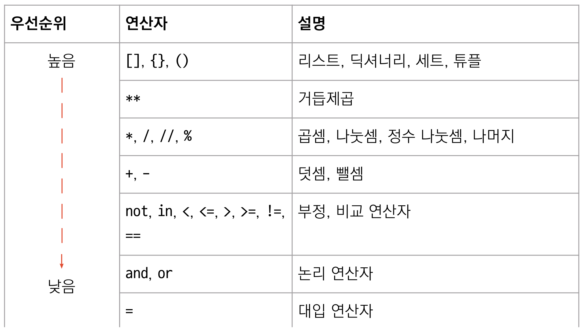

# 연산자 

## 산술 연산자 

|연산자|의미|
|---|---|
|+|두 수의 더한 결과|
|-|두 수의 뺀 결과|
|*|두 수의 곱한 결과|
|/|두 수의 나눈 결과|
|//|두 수의 나눈 결과의 몫|
|%|두 수의 나눈 결과의 나머지|
|**|거듭 제곱|

- [예제 1. 산술 연산자 예제](./ex01.py)

## 비교 연산자

|연산자|의미|
|---|---|
|> |연산자 왼쪽 값이 오른쪽 값보다 큼|
|>= |연산자 왼쪽 값이 오른쪽 값보다 크거나 같음|
|< |연산자 왼쪽 값이 오른쪽 값보다 작음|
|<= |연산자 왼쪽 값이 오른쪽 값보다 작거나 같음|
|== |연산자 왼쪽 값이 오른쪽 값보다 작거나 같음|
|!= |연산자 왼쪽 값이 오른쪽 값보다 작거나 같음|

- [예제 2. 비교 연산자 예제](./ex02.py)

## 논리 연산자 

|연산자|의미|
|---|---|
|and |연산자 왼쪽과 오른쪽이 모두 참이면 참|
|or |연산자 왼쪽과 오른쪽 중 하나라도 참이면 참|
|not |값이 참이면 거짓, 거짓이면 참|

## 연산자의 우선순위

<!--  -->

## 변수로 연산하기 

|연산자|연산자 사용 예|연산자 의미|
|---|---|---|
|+= |number += 2||
|-= |number -= 1||
|*= |number *= 2||
|/= |number /= 2||
|**= |number **= 2||
|//= |number //= 2||
|%= |number %= 2|

- [예제 3.변수로 연산하기 예제](ex03.py)

## 함수로 연산하기 

- 패키지, 클래스, 함수 관계

- 내장 패키지에 있는 숫자형 연산 함수들

    | 함수 | 의미 |
    | --- | --- |
    | `abs(x)` ||
    | `pow(x, y)` ||
    | `max()` ||
    | `min()` ||
    | `round(x,d)` ||
    | `floor()` ||
    | `ceil()` ||
    | `sqrt()` ||

- `math` 패키지에 있는 숫자형 연산 함수들

    | 함수 | 의미 |
    | --- | --- |
    | `floor()` ||
    | `ceil()` ||
    | `sqrt()` ||

- ``