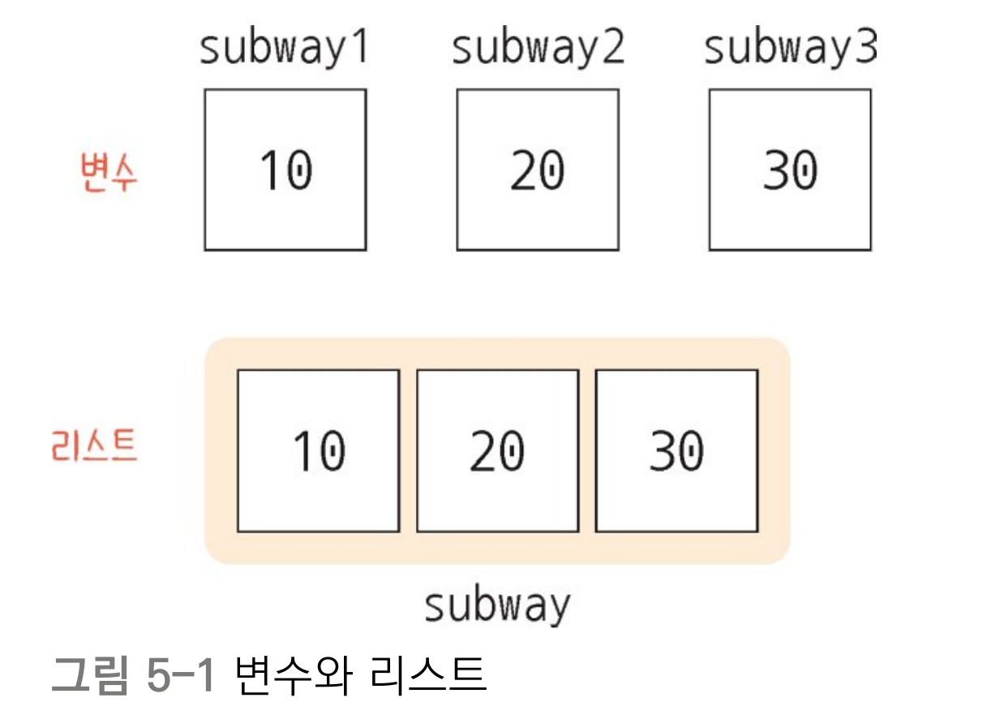
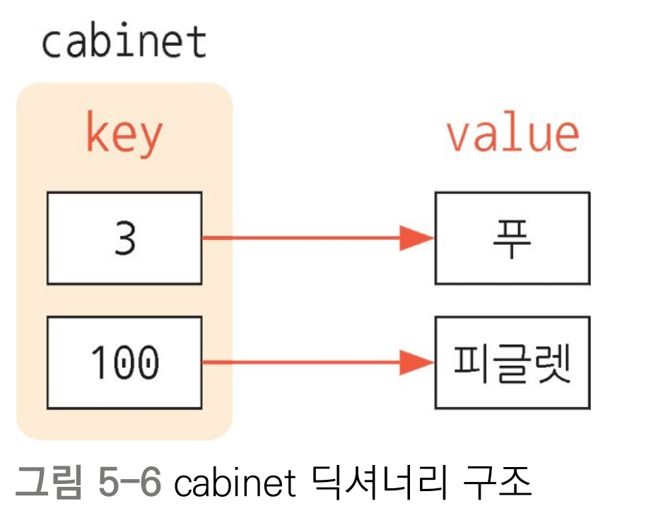

# 자료구조
- 컴퓨터는 데이터를 가공하는 강력한 계산기로, 프로그램은 각종 데이터를 효율적으로 저장하고 가공하기 위한 자료구조가 필요하다.

 

## 리스트
- 여러 값을 일렬적으로 저장하는 자료구조

      

- [리스트로 어떤 것을 할 수 있나요?](ex01.py)
    - 값의 추가
        - `subway.append("이요르")`
        - `subway.insert(1,"루")`
    - 값의 삭제
        - `subway.pop()`
        - `subway.pop(1)`
        - `subway.remove("루")`
        - `del subway[1]`
        - `subway.clear()`
    - 중복 값 확인하기
        - `subway.count("푸")`
    - 정렬하기
        - `num_list.sort()`
        - `num_list.sort(reverse=True)`
        - `num_list.reverse()`
    - 합치기
        - 리스트 포함시키기
            - `list1.append(list2)`
        - 리스트 확장하기
            - `list1 += list2`
            - `list1.extend(list2)`

- 문제
    - https://school.programmers.co.kr/learn/courses/30/lessons/120833
    - https://school.programmers.co.kr/learn/courses/30/lessons/120824

## 딕셔너리
- 사전과 같이 키와 값의 형태로 데이터를 저장하는 자료구조

    <!--    -->

- [딕셔너리로 어떤 것을 할 수 있나요?](ex02.py)
    - 딕셔너리 만들기
    - 값 가져오기
        - 특정 키에 할당된 값 가져오기
            - ``
            
            > `get()`과 `[]` 차이
            > 딕셔너리에 없는 키에 접근할 경우 `get()`은 `None` 또는 2번째 전달된 파라미터를 반환, `[]`은 에러 발생
        
        - 특정 키에 대응되는 값이 있는지 확인하기
            - ``
    
    - 값 변경/추가/삭제하기
        - 값 추가/변경
            - ``
        - 값 삭제
            - ``

    - 순회하기
        - `keys()`, `values()` 그리고 `items()`

## 튜플
- 읽기 전용 리스트입니다. 튜플은 처음 정의할 때를 제외하고 값의 변경이나 추가, 삭제 등이 불가능하며, 값의 순서도 변경할 수 없습니다. 하지만 리스트에 비해 읽기 속도가 매우 빠릅니다.  

- 튜플 예제

## 세트

## 자료구조 변환