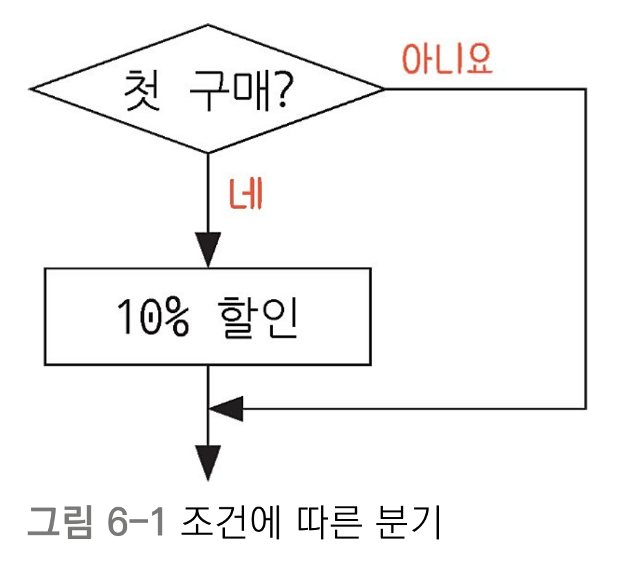

# 제어문
<!-- 제어문은 프로그램의 실행 흐름을 제어하는 구문으로, 조건문과 반복문이 포함됩니다. -->

## 조건문
- 조건문은 조건식의 결과에 따라 프로그램의 실행 흐름을 변경하는 구문입니다.
    
    

- 예제로 `if`문 알아보기 
    - [조건이 1개일 때](ex01.py)
    - [조건이 여
    
    러 개 일 때](ex02.py)
    - [모든 조건이 맞지 않을 때](ex03.py)
    - [input()으로 값 입력받아 비교하기](ex04.py)

## 반복문
- 반복문은 특정 코드를 반복적으로 실행하는 구문입니다

- 예제로 알아보는 반복문
    - [범위 안에서 반복하기: for문](ex05.py)
    - [조건을 만족할 동안 반복하기: while문](ex06.py)
    - [반복문 흐름제어 (띄어넘기, 종료하기): continue와 break](ex07.py)
    - [새로운 리스트 만들기: 리스트 컴프리헨션 (List comprehension)](ex08.py)
    - [리스트 반복하기](ex09.py)
    - [딕셔너리 반복하기](ex10.py)

# 마무리 문제
- 