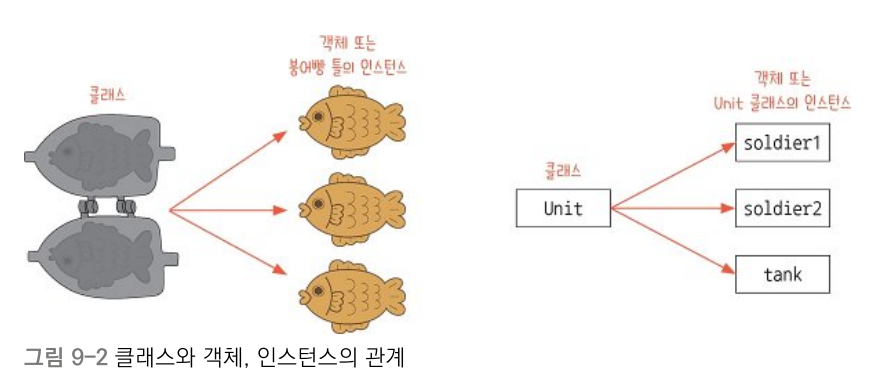

# 클래스 

## 클래스 정의하기 

클래스는 객체 지향 프로그래밍의 핵심 요소로, 데이터와 이를 조작하는 메서드를 하나의 캡슐로 묶어주기 위해 사용됩니다.   

클래스와 객체는 붕어빵 틀과 붕어빵에 자주 비유됩니다. 클래스는 객체를 만드는 틀로 객체의 기본적인 골격을 설계하고, 객체는 클래스가 제공하는 틀 내에서 고유한 특징을 소유합니다. 
- 클래스는 사람이고, 객체는 상혁이라고 연관지어 알아둡시다. 

    

### 클래스와 객체 생성하기 

클래스는 만드는 형식은 아래와 같습니다. 

```python
class 클래스 명: 
    def __init__(self, 전달값들 ... ):
        self.인스턴스_변수들 = 전달값들

    def 메서드명_1 (self, 전달값1, 전달값2 ...):
        실행할 명령들

    def 메서드명_2 (self, 전달값1, 전달값2 ...):
        실행할 명령들
```

- 클래스의 학습은 몇단계로 구성되어 있습니다. 그중 가장 첫 번째 단계에서는 인스턴스 변수, 메서드, 생성자를 알아두는 것이 가장 중요합니다.

    - 인스턴스 변수는 사람의 이름, 나이, 키와 같은 고유한 특성 데이터를 저장하기 위한 객체만을 위한 변수 입니다. 
        - `객체이름.인스턴스_변수_이름` 과 같은 방식으로 접근할 수 있습니다.

    - 메서드는 인스턴스 변수를 이용하여 특수한 작업을 하기 위한 함수 입니다. 
        - `객체이름.메서드_이름()` 과 같은 방식으로 호출할 수 있습니다.
        
    - 생성자는 인스턴스 변수의 초기화를 위해 사용되는 특별한 메서드입니다. 생성자는 별도로 호출하지 않아도 